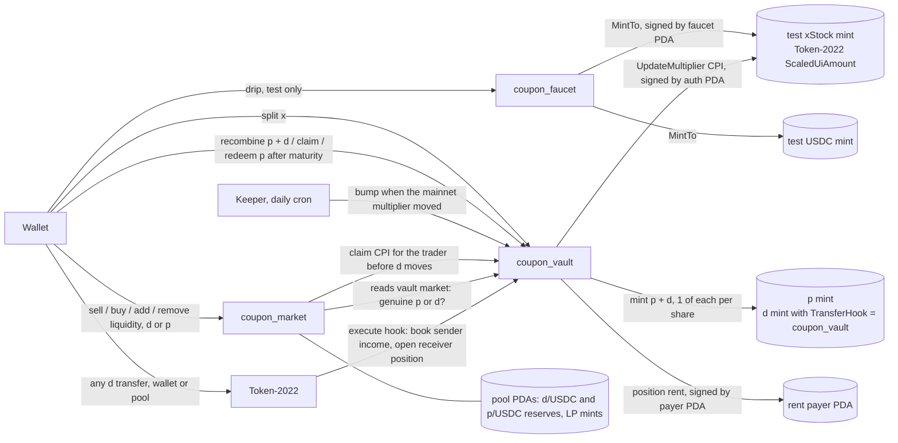

# COUPON

Sell next year's dividends today.

COUPON splits an xStock (Backed's tokenized equities on Solana, e.g. SPYx) into
a share token (pSPYx) that keeps the base units and a 12 month dividend coupon
(dSPYx) that collects every Token-2022 multiplier bump. Holders sell the coupon
for cash now; buyers pick up dividend exposure below fair value.

## What is real

| Piece | Source |
|---|---|
| Multipliers | Token-2022 `scaledUiAmountConfig` read live from each xStock mint on Solana mainnet (SPYx `XsoCS1TfEyfFhfvj8EtZ528L3CaKBDBRqRapnBbDF2W`) |
| Bump history | api.xstocks.fi public multiplier history, latest entry cross checked against the mint fields |
| xStock price | Pyth Hermes when `PYTH_API_KEY` is set (Hermes now requires a key); otherwise the live Solana market price from Jupiter |
| Pyth reference | Pyth price update accounts on Solana mainnet (push oracle `pythWSnswVUd12oZpeFP8e9CVaEqJg25g1Vtc2biRsT`), shown with last update date |
| Wallet balances | Read only xStock balances for the connected wallet on mainnet |
| Vault, pools, faucet | Three Solana programs on devnet (below). Every split, trade, claim and faucet drip is a real devnet transaction with test tokens. Nothing trades on mainnet |
| Test xStocks | Token-2022 mints on devnet with the ScaledUiAmount extension; the admin mirrors the real mainnet multiplier onto them |

Coupon fair value = xStock price x trailing 12 month multiplier growth. The
trade price comes from each coupon's onchain constant product pool (30 bps fee),
seeded at 0.935 x fair.

## Architecture

Three native Solana programs (no Anchor) share one `common` crate for program
ids, error codes, checked math and Token-2022 parsing. coupon_vault is also the
Token-2022 transfer hook of every d mint.



Accounts (PDA seeds):

| Program | Accounts |
|---|---|
| coupon_vault | `config` (admin), `auth` (mint and multiplier authority), `market`+xMint (p/d mints, base multiplier, frozen final multiplier, maturity), `pos`+market+d token account (multiplier snapshot and income owed, one per d token account), `payer` (system account that pays rent for positions the hook opens; devnet `CoXG2GgThVv3JB4aufM32RCgUaqFi8bEELgfU8mVMAdK`), `extra-account-metas`+dMint (the hook's account list) |
| coupon_market | `config` (admin, USDC mint), `pool`+mint for each p and d mint (reserves, LP mint; the pool PDA owns both reserve accounts and mints LP) |
| coupon_faucet | `config`, `faucet` (mint authority of the test mints), `drip`+mint+user (last claim time) |

Instruction flow:

1. **Split**: the user deposits x into the vault and receives `x_raw x m / m_base` p and d.
   p keeps the base units (a fixed number of shares at maturity); d collects every bump.
2. **Bump**: the keeper mirrors the real mainnet multiplier onto the test mint
   (`UpdateMultiplier` CPI signed by the vault auth PDA; see Keeper below).
3. **Claim**: a d holder receives `owed + d x (1/snapshot - 1/m) x m_base` raw x, capped at the
   vault balance minus the share liability, so p holders are always fully covered.
   The snapshot resets on every claim.
4. **Transfer hook**: every d transfer (Phantom or any wallet, and every pool move) makes
   Token-2022 call coupon_vault `execute`. It books the sender account's income up to now
   into `owed` and settles the receiver account the same way. If the receiver account has no
   position yet, the hook creates it (rent from the `payer` PDA) with the current multiplier
   as its snapshot. A holder therefore only earns bumps that happen while it holds the coupon,
   from the moment the coupons arrive.
   The hook only runs inside a real transfer (it checks the source account's `transferring`
   flag), and the d mints have no hook authority, so nobody can repoint it.
5. **Trade**: `coupon_market` runs the same constant product code for d/USDC and p/USDC
   pools (30 bps fee). For d it CPIs vault `claim` for the trader first and passes the hook
   accounts on every d transfer. `init_pool` only accepts a mint that the vault market lists
   as its p or d and whose mint authority is the vault auth PDA (anything else fails with code 13).
   Share pools open at fair value: base units x xStock price minus the coupon's fair value.
6. **Maturity**: after maturity the multiplier used for claims freezes at its first read,
   splits stop, the final coupon claim pays up to maturity, and p redeems for its base units.
   **Recombine**: p + d burn back into x at any time.

Positions are keyed by d token account, not by owner, because the hook only sees token
accounts. An owner with several d accounts (an ATA plus any other account) has one position
per account; the app sums them and its claim button claims every account with income, each
exactly. The hook account list is `[market w, x mint, pos(source) w, pos(destination) w,
payer w, System Program]`; `sync_metas` (ix 10, admin) rewrites the list of an existing d
mint after an upgrade, so no mint had to be recreated. If the payer ever runs dry the
transfer still succeeds and the receiver's position opens at its first claim instead.

## Program

Devnet deployment (`src/lib/vault/deployment.devnet.json`):

| | Address |
|---|---|
| coupon_vault (also the d transfer hook) | `9Q2QA1TmocSh7rDZWn8kxWGpoJHrxjDRV8NLxw2tVoVe` |
| coupon_market | `EPCXp2gEtwa6c28x19XgM2oV9k3T5pLsUiAzEaJUc3WN` |
| coupon_faucet | `5SYQ5Pp1AfR2QRLQy4WFyqbHdrVtECJ1GdkwwPepEDRE` |
| Admin / upgrade authority | `9G8fuNucXYpxFcyboUmbdxy35PQ3wM7tbjUPJz6raTkV` |
| Test USDC (6 decimals) | `AsGSH7q37BC9Zd8P7iUxtka64dv9LimCJVysSeTZE7av` |

| Asset | Test xStock | Share p | Coupon d (transfer hook) | d/USDC LP | p/USDC LP |
|---|---|---|---|---|---|
| SPYx | `96knLtNNoMBPi9sWZusf1sTUXiVudedfTQhjAuWAnB71` | `FkYwmoZJhh1WbUpigjfb35jWL3C94U3iEiJzg3wMkXDp` | `G913rrzqhLYq4KLuczwQHo1wAdZ95dch3Yc7kmrdF7es` | `4jxyzWKba6zjKKVWj9jcyEG4YqpXnJn6D3khb2TqLVbx` | `2ag9VrVfiu74cgohM5wUJjy9zRPGFggEw6P2Pk9PAJhZ` |
| MSFTx | `5T2VsWf2BkDjmr359yTDxAAByEBq3Xny9NKnNK2CRV3e` | `J1hWYtkHGTFShCCimP5FtjFwvrsZ1R1SXR688oibNoAz` | `6XtHqgGAYUY5Z6XZYpicxJrKeiGEkLo6sHJXkMCoptJJ` | `8UWxX2yHneUSVkAEsP6nkaW7LfQbDUuWXcpuKngUyDVd` | `ExxEAFqvhtGDbzqGF2uN6VmVX8K2ibw8F5bTV5Dn4E76` |
| QQQx | `5xUMDjroCYSQPdSQRRG4XUsUMCA5MFncfnkKxDSjQGVm` | `3mNhgBx9QLt89AZ7Swd1nMK1MTKHJqPpgqVSJqVm7TMQ` | `FLtWguaUWRi9fYu1opCtNydNgBzRo8WSNxg6io3ZK5g6` | `75FkmqGaZqBCVEUeYVgZGMJus8USvtNF8UmJUdqzVLV8` | `FBCwWxd7LMHh6e8UQTKXukKr8JCcQ3sVt8ESVMuAbqii` |
| AAPLx | `5Xq2CBi8P2WKuVKPDjw9jmb12qh2N1SMkF3Bkptpf6Xd` | `3GooHpXk4voe5GrkcVk69uHtSEJfPojZYKE2J7aCyAym` | `8HawxpEcg24wgrx53HufxDdbmWWMyQRm6anr9TMMjaRm` | `DCD61jDRUFUTCvrpRbJoQks1FCD6YpKiHa8VTJ29rXsi` | `DrBVZHeihS4QhATvXYZWK8WnWSaxiW7Y9dksJZLm8JTG` |
| METAx | `GC15HG6fiK5F5PWkbY8ofWtMHgzG21moe5Fox6G1enXr` | `CpZ5tKeftroHLNQDVj9gupnikBZSs3gh158GiySpSuzM` | `HHCu4JJME7Jr9m1abV5uyd851dPuXtfGu2aMotoM7fD8` | `9XujW99dX4wvKYdpipc6N36bXR6jQqs9fyhxsZQExRa9` | `H27Tzsy4H633vkPBxP5iSjfMEtGMBD1djF1styGsgfd2` |
| GOOGLx | `3gzcegf2dG6pTqXLEqMRZgsKcHGgHiN7uq4UAKq9MxF4` | `BAPAkwLjWx1Mrptjt9h8k7n9D3HyFVLfcxySFVV2wh8c` | `A5hbU8tWWXkn3XZ2FnKkT4JnxfkDySE4VQgo3cXAqbGv` | `9xA1tTPAKK2RfBL6DN3U4Wb1ZXAysVA7i79oZ7jWGSf9` | `3XgXKLPgsKj3CSARscjt4sBbarVx3ZNAUDTKa1DpEx34` |
| NVDAx | `DYrg2zwrCRnKQvusqYp8neHUjaqX379wQbk8XTTa5naE` | `D4yWfiUzxxiQzC2SU3fMdsnY9Lt3kmjoHtvvE6z1sCx3` | `Bj9kXFp2xqu6n526oYwQCDEGH7dw38h4PXcfXsawrPg9` | `8fgcZNHu86m2DXFEuNSZiyWe96TNMEfmcrWXaxnVh2Sv` | `3x6i9cLhxeLzoSijxmPjyDZBFXWvUQGL3tz8AonbBEmt` |
| TSLAx | `4unjS23PM92iQiCoCH5wcWAhaVGnHcMydpBcKweuaQ8z` | `3EEKFJCFCb3XeXhtwbcpShyW6b6fgHvvcjfpCwbiFCHK` | `D1TJaKyuMGJuc2wwR8c2SaLzUJJSmNZNY7ZFjMWnsFUJ` | none (no dividend in 12 months) | `E6M5efqjUi4RrQRXEGfSAUuEVfbkDqcxE3gXXRdok7V2` |
| AMZNx | `BWnSKZ2eTDRkogDQ6vwH9qFeQ4tsXXhPB6DUjxnbcCdn` | `4tVJUVksj5iyeKsdFmuTSn8Xw6ogVVnQv2r1rZF3praw` | `8yZfsy1NzK6ddem2bRR6saZsavkVcYAEJ4558upHHuva` | none (no dividend in 12 months) | `5qQSX5EtJzRwPyDraSuwfV1BLn8Gx2n2VS12broraZAV` |

Short maturity test market (hidden in the app, label `SPYx short maturity test`, maturity 10 minutes after init): x `3GR5cDp2QcXkXnMyXur2PgnqG9Sro6FJRgpRgdArYDP3`, p `93jaZV7i55pssq1iNwUMBKG2q5QR3uMTzQdCutjKHV2`, d `5teGkbqBwTYjhfV4gNFcMcekAnJrggLZnJFXu4iuJV61`.

The faucet is test only: it mints the test xStocks and test USDC above (100 xStock
or 1,000 USDC per claim, one claim per token per hour) and cannot mint anything else.
Fees need devnet SOL from https://faucet.solana.com.

Maturity: `init_market` takes the maturity in seconds from the admin. That is only for
this test deployment, so the short maturity market can exercise redeem on devnet in
minutes. Build with `--features fixed-maturity` to pin every market to 12 months.

Tests:

```
cd program
cargo test                                   # math, maturity gate (clock values), transfer accrual, parsing
cd .. && bun run test && cd program          # SDK encodings match idl/*.json
for p in coupon_vault coupon_market coupon_faucet; do
  cargo-build-sbf --manifest-path programs/$p/Cargo.toml --sbf-out-dir target/deploy
done
solana-test-validator --reset \
  --bpf-program 9Q2QA1TmocSh7rDZWn8kxWGpoJHrxjDRV8NLxw2tVoVe target/deploy/coupon_vault.so \
  --bpf-program EPCXp2gEtwa6c28x19XgM2oV9k3T5pLsUiAzEaJUc3WN target/deploy/coupon_market.so \
  --bpf-program 5SYQ5Pp1AfR2QRLQy4WFyqbHdrVtECJ1GdkwwPepEDRE target/deploy/coupon_faucet.so
cd ..
bun scripts/vault-setup.ts http://127.0.0.1:8899 .deploy/localnet.json <vault> <market> <faucet>
bun scripts/vault-verify.ts http://127.0.0.1:8899 .deploy/localnet.json SPYx
bun scripts/vault-maturity.ts http://127.0.0.1:8899 .deploy/localnet.json 20
```

`vault-verify` runs every instruction through the same TypeScript SDK the app uses
(`src/lib/vault/sdk.ts`) and asserts balances and error codes: faucet, cooldown reject,
split, slippage reject, sell, bump, claim, recombine, buy, add and remove liquidity,
p buy and sell on the share pool, a wallet to wallet d transfer built with spl-token's
hook resolver (the path wallets use) followed by claims that show the receiver cannot
claim the bump before it held the coupons, a transfer into a brand new wallet (the hook
opens its position at the current index, rent paid by the payer PDA) then a bump and its
exact claim, one owner with two d token accounts claiming each exactly, a direct hook call reject, fake coupon pool
reject, redeem before maturity reject. `vault-maturity` creates the short maturity
market, splits, bumps, waits for maturity with the real chain clock, then makes the
final coupon claim and redeems every share. Devnet signatures:
`src/lib/vault/deployment.devnet.verify-SPYx.json` and
`src/lib/vault/deployment.devnet.verify-maturity.json`.

Program upgrades use the deployer as upgrade authority (`solana program deploy
--program-id <id> --buffer <keypair>`), and upload buffers are closed afterwards.
Program data rent on devnet: vault 0.728 SOL, market 0.745 SOL, faucet 0.509 SOL.

## Keeper

`src/lib/vault/keeper.ts` reads every mainnet xStock multiplier and the matching devnet
test mint, and sends the admin `bump` only when mainnet is higher. It runs two ways:

- `bun scripts/keeper.ts <devnet rpc> src/lib/vault/deployment.devnet.json [markets api] [--dry]`
  (admin key from `COUPON_ADMIN_KEY` or `.keys/deployer.json`).
- `GET /api/keeper`, called daily by Vercel cron (`vercel.json`). It needs
  `Authorization: Bearer $CRON_SECRET` (401 otherwise, 503 when unset). The admin key only
  comes from the server env var `COUPON_ADMIN_KEY` (JSON byte array); without it, or with
  `?dry=1`, the route reports what it would do and signs nothing.

Last run: no bumps needed. Eight markets equal mainnet; devnet SPYx is ahead because the
verification script bumps it (`src/lib/vault/deployment.devnet.keeper.json`).

## IDL

`idl/coupon_vault.json`, `idl/coupon_market.json`, `idl/coupon_faucet.json` are Shank style
IDLs (u8 instruction tag, little endian args, accounts with signer and writable flags)
generated from the instruction docs in each `lib.rs` by `bun run idl`. `test/idl.test.ts`
builds every SDK instruction and checks program id, tag, data length, account count and
flags against them, plus the hook account layout.

## v1 (deprecated)

The first devnet markets (owner keyed positions, mints listed in git history at
`8613e2f:src/lib/vault/deployment.devnet.json`) are deprecated and hidden from the app.
Their upload buffers are closed, and all 36 v1 token accounts held by our keys were
burned and closed (0.054 SOL rent back). Pool reserve accounts owned by v1 pool PDAs and
the v1 market accounts stay: closing them needs a `close_market` admin instruction, which
was left out on purpose because it would strand any outside holder and add an admin power.
The owner keyed `pos` accounts from before the per account layout are orphaned (the
program no longer reads them).

## Remaining gaps

- Test tokens only; nothing trades on mainnet. The keeper copies mainnet multipliers onto
  devnet mints once a day (Vercel Hobby cron limit).
- The rent payer PDA can be drained by dust transfers to fresh accounts, but each one costs
  the sender more in token account rent than it drains, and an empty payer only delays a
  position to the receiver's first claim. The empty payer path was reviewed in code but not
  exercised on chain.
- A token account owner change (SetAuthority) moves the position with the account, which
  is the intended behavior but is not surfaced in the app.

## Run

```
bun install
bun run build
bun run start --port 3460
```

Env: see `.env.example` (`NEXT_PUBLIC_SOLANA_RPC`, optional `NEXT_PUBLIC_COUPON_DEPLOYMENT`,
`SOLANA_RPC`, `PYTH_API_KEY`, `PYTH_HERMES_URL`, keeper: `CRON_SECRET`, `COUPON_ADMIN_KEY`,
`KEEPER_RPC`).

APIs: `/api/markets`, `/api/pyth`, `/api/chain?x=SPYx`, `/api/holdings?owner=<address>`,
`/api/keeper` (cron, bearer protected).

On phones the tab bar holds Markets, Split, Trade, Portfolio and Faucet. The replay of every
real multiplier bump lives behind the Proof card at the top of Markets and the Verify link
on each market (`/app/replay?x=<asset>`); desktop keeps Replay in the top nav.

## Deploy on Vercel

1. Import the repo; framework preset Next.js, build command `bun run build`
   (or `next build`). No custom server is needed.
2. Set `NEXT_PUBLIC_SOLANA_RPC` (a devnet RPC; the public one rate limits) and
   optionally `SOLANA_RPC` and `PYTH_API_KEY`.
3. The devnet deployment JSON is committed, so the app points at the programs above
   with no extra config. Chain read caches go to `/tmp` on Vercel.
4. For the keeper cron set `CRON_SECRET` and `COUPON_ADMIN_KEY` (the admin keypair as a
   JSON byte array, server only). `vercel.json` schedules `/api/keeper` daily.
