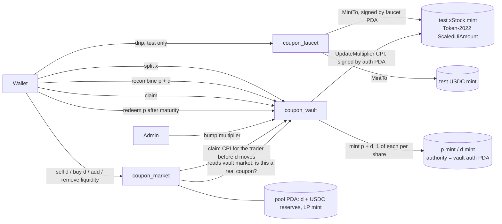

# COUPON

Sell next year's dividends today.

COUPON splits an xStock (Backed's tokenized equities on Solana, e.g. SPYx) into
a share token (pSPYx) that keeps the base units and a 12 month dividend coupon
(dSPYx) that collects every Token-2022 multiplier bump. Holders sell the coupon
for cash now; buyers pick up dividend exposure below fair value.

## What is real

| Piece | Source |
|---|---|
| Multipliers | Token-2022 `scaledUiAmountConfig` read live from each xStock mint on Solana mainnet (SPYx `XsoCS1TfEyfFhfvj8EtZ528L3CaKBDBRqRapnBbDF2W`) |
| Bump history | api.xstocks.fi public multiplier history, latest entry cross checked against the mint fields |
| xStock price | Pyth Hermes when `PYTH_API_KEY` is set (Hermes now requires a key); otherwise the live Solana market price from Jupiter |
| Pyth reference | Pyth price update accounts on Solana mainnet (push oracle `pythWSnswVUd12oZpeFP8e9CVaEqJg25g1Vtc2biRsT`), shown with last update date |
| Wallet balances | Read only xStock balances for the connected wallet on mainnet |
| Vault, pools, faucet | Three Solana programs on devnet (below). Every split, trade, claim and faucet drip is a real devnet transaction with test tokens. Nothing trades on mainnet |
| Test xStocks | Token-2022 mints on devnet with the ScaledUiAmount extension; the admin mirrors the real mainnet multiplier onto them |

Coupon fair value = xStock price x trailing 12 month multiplier growth. The
trade price comes from each coupon's onchain constant product pool (30 bps fee),
seeded at 0.935 x fair.

## Architecture

Three native Solana programs (no Anchor) share one `common` crate for program
ids, error codes, checked math and Token-2022 parsing.



Accounts (PDA seeds):

| Program | Accounts |
|---|---|
| coupon_vault | `config` (admin), `auth` (mint and multiplier authority), `market`+xMint (p/d mints, base multiplier, maturity, total shares), `pos`+market+owner (multiplier snapshot for coupon income) |
| coupon_market | `config` (admin, USDC mint), `pool`+dMint (reserves, LP mint; the pool PDA owns both vaults and mints LP) |
| coupon_faucet | `config`, `faucet` (mint authority of the test mints), `drip`+mint+user (last claim time) |

Instruction flow:

1. **Split**: the user deposits x into the vault and receives `x_raw x m / m_base` p and d.
   p is a claim on a fixed number of shares at maturity; d collects every bump.
2. **Bump**: the admin mirrors the real mainnet multiplier onto the test mint
   (`UpdateMultiplier` CPI signed by the vault auth PDA).
3. **Claim**: a d holder receives `d x (1/snapshot - 1/m) x m_base` raw x, capped at the
   vault balance minus the share liability, so p holders are always fully covered.
   The snapshot resets on every claim.
4. **Trade**: `coupon_market` CPIs vault `claim` for the trader before the d balance
   changes, so income accrued so far goes to the seller, not the buyer.
   `init_pool` only accepts a d mint that the vault market lists and whose mint
   authority is the vault auth PDA (a fake coupon is rejected with code 13).
5. **Recombine**: p + d burn back into x at any time. **Redeem**: p alone after maturity.

Known limitation: a plain wallet to wallet d transfer outside these programs does
not settle the sender first, so the receiver can claim from an older snapshot. The
cap above keeps share holders whole; the exposure is the unclaimed surplus meant for
other coupon holders. A Token-2022 transfer hook that calls claim is the production fix.

## Program

Devnet deployment (`src/lib/vault/deployment.devnet.json`):

| | Address |
|---|---|
| coupon_vault | `9Q2QA1TmocSh7rDZWn8kxWGpoJHrxjDRV8NLxw2tVoVe` |
| coupon_market | `EPCXp2gEtwa6c28x19XgM2oV9k3T5pLsUiAzEaJUc3WN` |
| coupon_faucet | `5SYQ5Pp1AfR2QRLQy4WFyqbHdrVtECJ1GdkwwPepEDRE` |
| Admin / upgrade authority | `9G8fuNucXYpxFcyboUmbdxy35PQ3wM7tbjUPJz6raTkV` |
| Test USDC (6 decimals) | `AsGSH7q37BC9Zd8P7iUxtka64dv9LimCJVysSeTZE7av` |

| Asset | Test xStock | Share p | Coupon d | Pool LP |
|---|---|---|---|---|
| SPYx | `FLu89b3ANbMp23ovAcp7iAxd6NUz4DXLNRLLUPwH9b2b` | `ADYcoQCQZ1EtGK5BVSUj5DMJeMopr9rMdMuHa7BujMD1` | `HoHrhRXsasqmMmqB45zWtWF8YUtxeNGvCamutJvmgda8` | `F11BXnwVvb8Kam3oLcp1qzqkDA1hNSWp9erxvqooEg1v` |
| MSFTx | `4f6zk5tPacSrMyMecYB3tp6fNdwHdwfsnHmUPQUbZPdA` | `A42fBAt4HmFpRDsw5r9RXDeQFLy2dYU6F2D1d34anGNJ` | `39fbUyY4ZN5RDtWYrBJWCi8dME9QvJmthRtf7T5pMEAF` | `FtsLsk4XdKBo6by41jwV4WGWuvScCbp96zhLhGEFfzrB` |
| QQQx | `7q39FRNqpme7KVoi29qnY4R9UCaSGheEw2xSDFWocxiy` | `AtfBvYzR8mM931KwtTkREzmNQPVmy3nnJsENNK3ykYxx` | `3rD4z7wncjjUxSpzvhigD7XuieDXYU8iymSmxRZiFz6m` | `HM9Kz3D1eboePpwoccdQw3n5iEBNaaLwC3qsVwDWXbaP` |
| AAPLx | `FtBiLWYjXHdRhRLJ2887xbz4CM1wNQWD3ByxZqLVzu7L` | `9yd2iEEsEUFa3KsQC5XA9pB3gMhb32mKGMQMiKNmjdc3` | `9FSASoruV3s66ZK3uiWLd9Gg8DZLDKVqDMA626o9zyJx` | `69J4Nm5YFRKiyzo1wqokVmL8c8vAJDMatCda6TYWWCqq` |
| METAx | `3wx3pUcMMpf48fdy8A2YPCwuKwfXcNauGp9aPphFfHJH` | `8xa9NhkPbhPNC6VRuhJs4Go9QLyXaomZXQU77dcc5cgW` | `9QBUzxjrWwgckjA9qiSmH41gFugzdFSaivXFgmRR1pdt` | `9XLDfiHZ6UHR8EAd1pYAA7pxCKw46Tg6ZtNj5vnZpXnz` |
| GOOGLx | `3qeMQQ8T7VjAtJWEdPBx7b7ZGpKFFoHmmQnsByFGSLbr` | `DBP3x35WXfhVqWypKAgacd1VEJvektqWkN6r5W3Ya3By` | `GkqJ3Mvr1Ve46ocowjhnQ214ANmFhgxfidX5SG9uuHcN` | `QvDXG9nzDraceuKEUxPB29gwdtdVKi7Npi8n8ru1x2a` |
| NVDAx | `BNDpR43GDKQpYex15aB9PqWWbjTaSB847QbD2UqN1Zes` | `8iftEt54CXcwugcSKSmXktPPqk4NQ5TW8xixsDLXe25C` | `BEFmirUejzzxfVLzgBn6noZTMMepw4fyDJvx7sDhbBzK` | `Cg6Zszkcq7dRbHebbg53up8S8vYt1LrEKn7oVDGLES9T` |
| TSLAx | `2pS5i3xnHUUrjGAAd63hBUo7uKxa7HT6rPna56stTLxd` | `9AtrWZnCGUMWy1M78JRzfqEQaNJQ1YCQvVb7BEUrPYkK` | `4RxZ2Tb8DTEFnhEXzNwNTC5w33BRx2E3a8hicSd45Tta` | no pool yet |
| AMZNx | `3eZi6eRBdVsbi7zmwKhhUBV7bwCEVaNGQgsDSUKEs2S6` | `HZBtX6JJRcp668xYDMZuNSqUmc375ud2YuowdpG1p5f5` | `7JjbsHo8LC6tSBsZ8BWcybT7TgGgdGnyUUpgkcnSj2YP` | no pool yet |

The faucet is test only: it mints the test xStocks and test USDC above (100 xStock
or 1,000 USDC per claim, one claim per token per hour) and cannot mint anything else.
Fees need devnet SOL from https://faucet.solana.com.

Tests:

```
cd program
cargo test                                   # math and parsing unit tests
for p in coupon_vault coupon_market coupon_faucet; do
  cargo-build-sbf --manifest-path programs/$p/Cargo.toml --sbf-out-dir target/deploy
done
solana-test-validator --reset \
  --bpf-program 9Q2QA1TmocSh7rDZWn8kxWGpoJHrxjDRV8NLxw2tVoVe target/deploy/coupon_vault.so \
  --bpf-program EPCXp2gEtwa6c28x19XgM2oV9k3T5pLsUiAzEaJUc3WN target/deploy/coupon_market.so \
  --bpf-program 5SYQ5Pp1AfR2QRLQy4WFyqbHdrVtECJ1GdkwwPepEDRE target/deploy/coupon_faucet.so
cd ..
bun scripts/vault-setup.ts http://127.0.0.1:8899 .deploy/localnet.json <vault> <market> <faucet>
bun scripts/vault-verify.ts http://127.0.0.1:8899 .deploy/localnet.json SPYx
```

`vault-verify` runs every instruction through the same TypeScript SDK the app uses
(`src/lib/vault/sdk.ts`) and asserts balances and error codes: faucet, cooldown reject,
split, slippage reject, sell, bump, claim, recombine, buy, add and remove liquidity,
fake coupon pool reject, redeem before maturity reject. The devnet run and its
signatures are in `src/lib/vault/deployment.devnet.verify-SPYx.json`.

`scripts/deploy-devnet.sh` builds, deploys each program once and runs setup and
verify. Program data rent on devnet: vault 0.926 SOL, market 0.949 SOL, faucet
0.698 SOL (2.573 SOL total), plus about 0.3 SOL for mints, pools and seeding.

## Run

```
bun install
bun run build
bun run start --port 3460
```

Env: see `.env.example` (`NEXT_PUBLIC_SOLANA_RPC`, optional `NEXT_PUBLIC_COUPON_DEPLOYMENT`,
`SOLANA_RPC`, `PYTH_API_KEY`, `PYTH_HERMES_URL`).

APIs: `/api/markets`, `/api/pyth`, `/api/chain?x=SPYx`, `/api/holdings?owner=<address>`.

## Deploy on Vercel

1. Import the repo; framework preset Next.js, build command `bun run build`
   (or `next build`). No custom server is needed.
2. Set `NEXT_PUBLIC_SOLANA_RPC` (a devnet RPC; the public one rate limits) and
   optionally `SOLANA_RPC` and `PYTH_API_KEY`.
3. The devnet deployment JSON is committed, so the app points at the programs above
   with no extra config. Chain read caches go to `/tmp` on Vercel.
